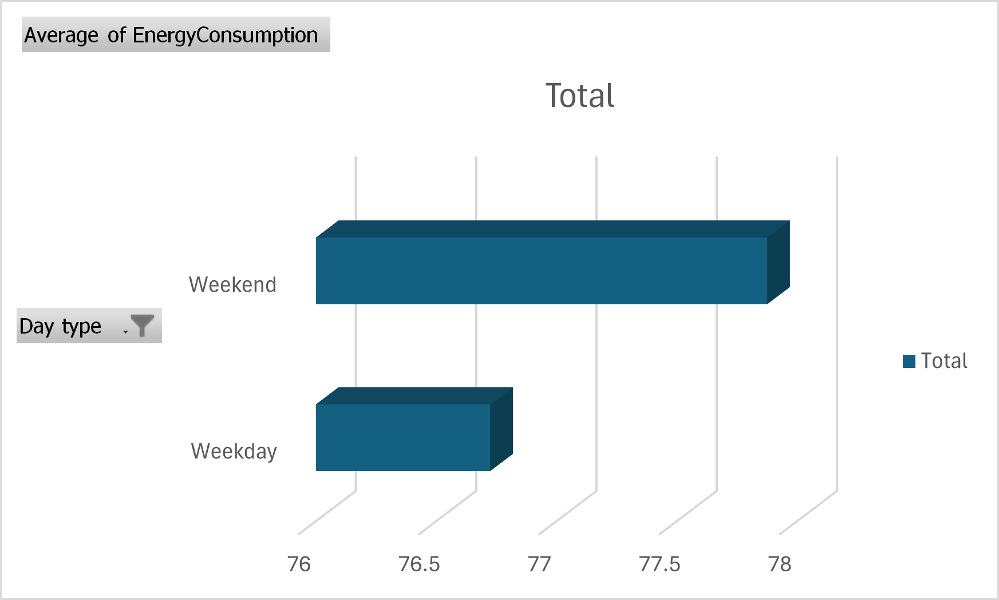
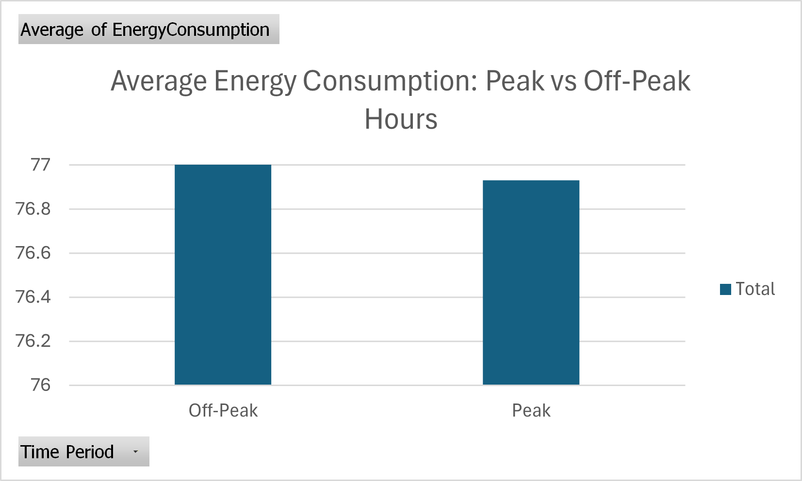
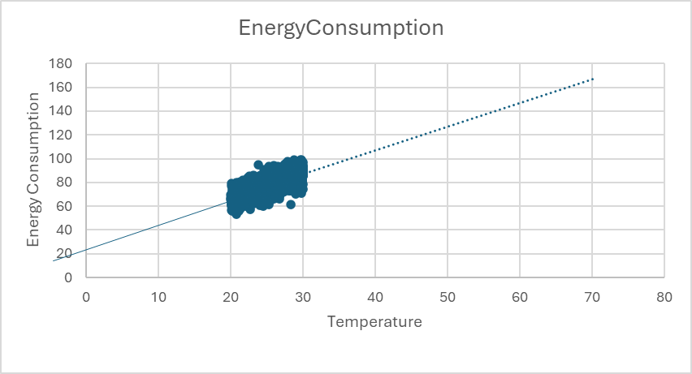

# energy-consumption-analytics-renewables
Business analytics case study analysing residential energy consumption to support renewable energy strategy and demand forecasting
# Energy Consumption Analytics for Renewable Energy Strategy
## Business Context
Renewable energy providers face increasing pressure to forecast demand accurately,
manage peak loads, and encourage greater adoption of renewable energy sources.

This analysis examines residential energy consumption patterns to identify demand
drivers and highlight opportunities where data-driven insights can support renewable
energy strategy and operational planning.
## Objective
The objective of this project is to:
- Analyse residential energy consumption patterns
- Identify differences in usage across time and day type
- Estimate the impact of temperature on energy demand using a regression model
- Highlight implications for renewable energy adoption and demand forecasting
## Data
The analysis uses a publicly available residential energy consumption dataset
covering approximately 1,000 households.

The dataset includes:
- Time-stamped energy consumption
- Renewable energy usage
- Environmental factors (temperature, humidity)
- Contextual indicators (day type, peak vs off-peak periods)

The data represents a short time window (January–February) and is used to
explore consumption patterns rather than long-term seasonality.
Data source: Public Kaggle dataset on residential energy consumption (https://www.kaggle.com/datasets/mrsimple07/energy-consumption-prediction/data)
## Approach
The analysis was carried out using a structured analytics workflow:

- Data cleaning and preparation to ensure consistency and usability
- Descriptive analysis to identify consumption patterns and behavioural differences
- Comparative analysis across weekdays, weekends, and peak vs off-peak periods
- Correlation analysis between temperature and energy consumption
- Linear regression modelling to estimate temperature-driven demand

The focus was on clarity, interpretability, and business relevance rather than
model complexity.

Analytical steps were guided by business questions around demand drivers,
renewable energy adoption, and peak-load management
## Key Insights
- Renewable energy accounted for approximately **20%** of total household energy consumption, which shows significant potential to increase adoption.

- Energy consumption was consistently higher during weekends and holidays compared to weekdays, reflecting increased residential demand.

- Average household energy consumption is only slightly higher during peak hours compared to off-peak periods, indicating that peak-load pressures are not driven by sustained increases in average daily usage.

- Temperature showed a moderately strong positive relationship with energy consumption, explaining approximately **48.5%** of demand variation

- Energy demand increased by roughly **2 units for every 1°C rise** in temperature
## Business Implications
- Renewable energy offerings could be targeted more aggressively during high-demand periods such as weekends and peak hours.
- Temperature-based demand forecasting can support short-term operational planning and capacity management.
- Smart-meter and time-of-use data enable pricing and incentive strategies that encourage load shifting and renewable usage.
- Short-term demand insights can inform longer-term investment and infrastructure planning for renewable energy assets.
## Tools
- Microsoft Excel
  - Data cleaning and preparation
  - Pivot-table based descriptive analysis
  - Linear regression using Analysis ToolPak
  - Visual analysis via charts
## Notes
This project is presented as a professional analytics case study, focused on
business insight, decision support, and clear communication of findings using
structured analytical methods and real-world datasets.
